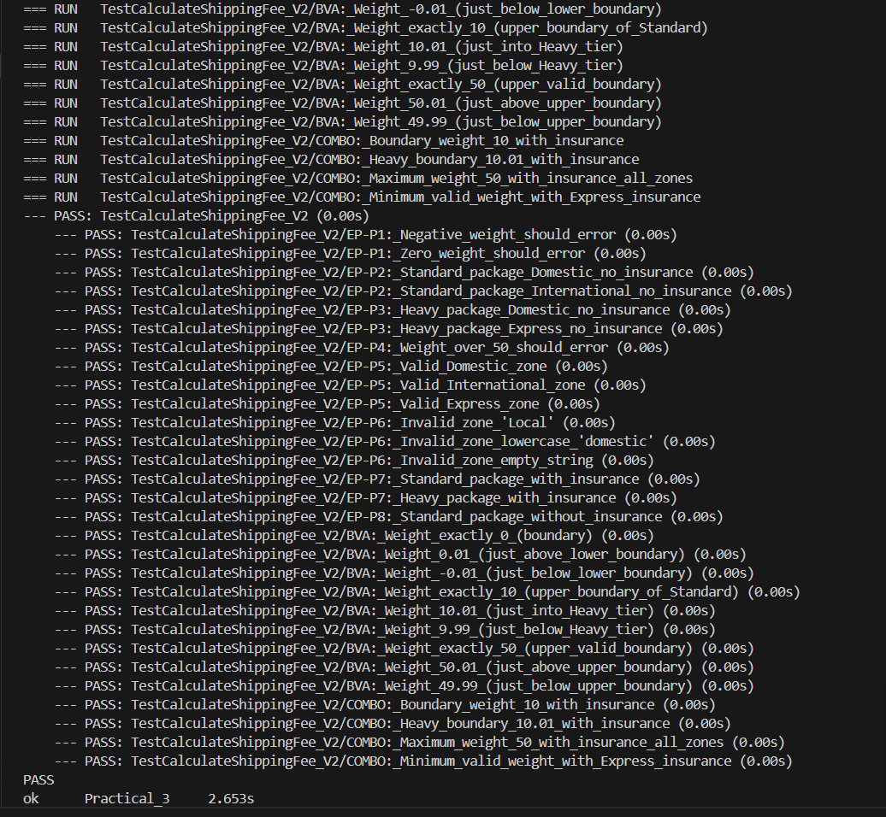
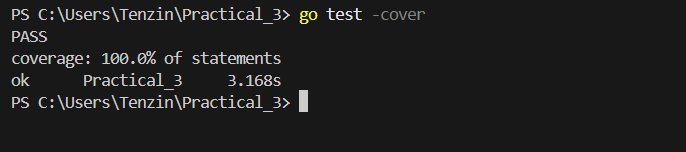

# Module Practical 3: Software Testing & Quality Assurance


This practical focuses on **specification-based testing** (black-box testing) techniques applied to a shipping fee calculator system. The goal is to design and implement comprehensive test cases based solely on business requirements, without examining the internal code implementation.

### Assignment Objectives
- Apply **Equivalence Partitioning** to group inputs into meaningful test categories
- Use **Boundary Value Analysis** to identify and test critical edge cases
- Implement systematic tests using Go's testing framework
- Achieve high code coverage through strategic test design

---

## System Overview

### Function Under Test
```go
CalculateShippingFee(weight float64, zone string, insured bool) (float64, error)
```

### Key Business Rules
1. **Weight:** Must be between 0 and 50 kg
   - Standard packages: 0 < weight ≤ 10 kg (no surcharge)
   - Heavy packages: 10 < weight ≤ 50 kg (adds $7.50 surcharge)

2. **Zone:** Three valid options with different base fees
   - "Domestic": $5.00
   - "International": $20.00
   - "Express": $30.00

3. **Insurance:** Optional 1.5% premium
   - Calculated on (base fee + heavy surcharge)

---

## Part 1: Equivalence Partitioning

I identified **8 distinct partitions** across all inputs:

### Weight Partitions
- **P1:** Invalid (≤ 0) → Should return error
- **P2:** Standard (0 < weight ≤ 10) → No surcharge
- **P3:** Heavy (10 < weight ≤ 50) → Add $7.50 surcharge
- **P4:** Invalid (> 50) → Should return error

### Zone Partitions
- **P5:** Valid zones ("Domestic", "International", "Express") → Process normally
- **P6:** Invalid zones (any other string) → Should return error

### Insurance Partitions
- **P7:** Insured (true) → Add 1.5% premium
- **P8:** Not Insured (false) → No premium

---

## Part 2: Boundary Value Analysis

I identified **9 critical boundary values** to test:

### Lower Weight Boundary (around 0 kg)
- **0 kg** → Should error (invalid)
- **0.01 kg** → Should accept (valid standard)
- **-0.01 kg** → Should error (invalid)

### Mid Weight Boundary (around 10 kg - Tier transition)
- **10 kg** → Should process as Standard (NO surcharge)
- **10.01 kg** → Should process as Heavy (WITH surcharge)
- **9.99 kg** → Should process as Standard (NO surcharge)

### Upper Weight Boundary (around 50 kg)
- **50 kg** → Should accept (valid heavy)
- **50.01 kg** → Should error (invalid)
- **49.99 kg** → Should accept (valid heavy)

**Why these boundaries matter:** Bugs commonly occur at boundaries due to off-by-one errors or incorrect comparison operators (e.g., using `<` instead of `≤`).

---

## Part 3: Test Implementation

### Test Suite Summary
- **Total Test Cases:** 29
- **Equivalence Partitioning Tests:** 16 tests covering all 8 partitions
- **Boundary Value Analysis Tests:** 9 tests for critical boundaries
- **Combination Tests:** 4 tests combining boundaries with insurance

### Test Organization
```go
func TestCalculateShippingFee_V2(t *testing.T) {
    // Table-driven test with 29 test cases
    // Each case tests specific partition or boundary
}
```

---

## Test Results

### Screenshot 1: All Tests Passing



**Explanation:** This output shows all 29 test cases executed successfully. Each test name indicates which testing technique it represents:
- `EP-P1`, `EP-P2`, etc. = Equivalence Partitioning tests
- `BVA` = Boundary Value Analysis tests
- `COMBO` = Combination tests

### Screenshot 2: Code Coverage



**Explanation:** Achieved **100% code coverage**, meaning every line of code in `shipping_v2.go` was executed during testing. This confirms that the  test suite is comprehensive and exercises all code paths.

---

## Key Implementation Details

### Files Created
1. **shipping_v2.go** - Implementation of the shipping fee calculator
2. **shipping_v2_test.go** - Comprehensive test suite with 29 test cases


### Testing Approach
- Used **table-driven tests** for clean, maintainable test code
- Applied **helper function** (`almostEqual`) to handle floating-point precision
- Organized tests by technique (EP, BVA, COMBO) for clarity
- Clear test naming convention for easy debugging

---

## What Was Tested

###  Invalid Input Handling
- Negative weights, zero weights, overweight packages
- Invalid zone strings (wrong case, typos, empty strings)

###  Valid Processing Paths
- All three zones (Domestic, International, Express)
- Both package tiers (Standard and Heavy)
- Insurance enabled and disabled scenarios

###  Critical Boundaries
- Weight boundaries at 0, 10, and 50 kg
- Exact boundary values and values just above/below each boundary

###  Business Logic
- Correct base fee application per zone
- Accurate heavy surcharge calculation (only for weight > 10)
- Proper insurance premium calculation (1.5% of subtotal)

---

## Conclusion

This  successfully demonstrated systematic test design using specification-based testing techniques. By applying Equivalence Partitioning and Boundary Value Analysis, I created a comprehensive test suite that:

-  Covers all business requirements
-  Tests all critical boundaries where bugs commonly occur
-  Achieves 100% code coverage

The black-box testing approach ensures tests remain valid even if internal implementation changes, as long as the specification remains constant.

