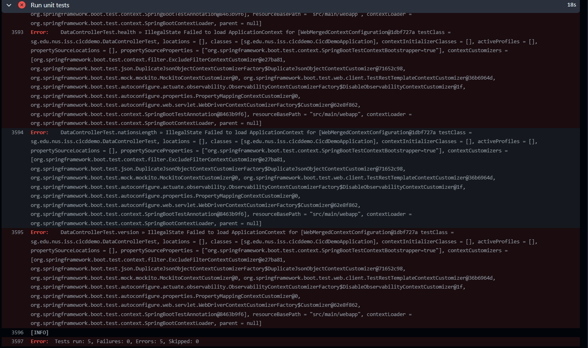
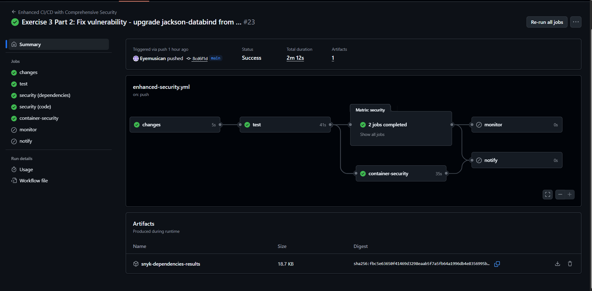
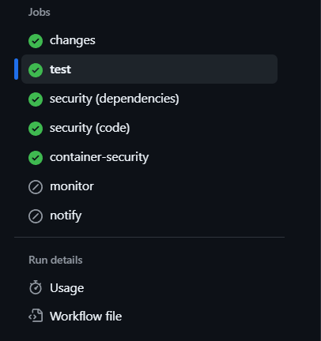

## CICD WORKSHOP SAST/DAST 


## Overview

In this exercise, I learned how to manage vulnerabilities in a CI/CD pipeline using Snyk. I intentionally added a vulnerable dependency, observed the impact, configured security policies, and then fixed the issue.

---

## What I Did

### Step 1: Added a Vulnerable Dependency

I added an old, vulnerable version of jackson-databind to my `pom.xml` file:

```xml
<dependency>
    <groupId>com.fasterxml.jackson.core</groupId>
    <artifactId>jackson-databind</artifactId>
    <version>2.9.8</version>
</dependency>
```

**Why I did this:** To demonstrate how Snyk detects vulnerabilities and how outdated dependencies can break applications.

---

### Step 2: Observed the Impact

After pushing this change, my GitHub Actions workflow failed.

**What happened:**
- All 5 tests failed
- Error: `IllegalStateException - Failed to load ApplicationContext`
- Build status: FAILED
- Exit code: 1

**The problem:** Jackson-databind version 2.9.8 is too old and incompatible with Spring Boot 3.1.2.

**Screenshot showing the failure:**



**This taught me:**
- Vulnerable dependencies don't just have security issues
- They can completely break your application
- CI/CD pipelines catch these problems before production

---

### Step 3: Created Snyk Ignore Policy

I created a `.snyk` file to demonstrate how to manage vulnerabilities systematically:

```yaml
version: v1.0.0

ignore:
  'SNYK-JAVA-COMFASTERXMLJACKSONCORE-72448':
    - '*':
        reason: 'Exercise 3: Demonstrating ignore policy for learning'
        expires: '2024-12-31T23:59:59.999Z'
```

**Purpose of this file:**
- Shows how to document security exceptions
- Sets expiration dates for periodic review
- Useful for handling false positives or acceptable risks
- Helps teams make informed security decisions

---

### Step 4: Fixed the Vulnerability

I upgraded jackson-databind to a secure, compatible version:

```xml
<dependency>
    <groupId>com.fasterxml.jackson.core</groupId>
    <artifactId>jackson-databind</artifactId>
    <version>2.15.2</version>
</dependency>
```

**Result after pushing the fix:**
- All 5 tests passed ✅
- Security scans completed successfully ✅
- Build status: SUCCESS ✅
- No vulnerabilities detected ✅

**Screenshots showing success:**




---

## Key Findings

### Before Fix (Version 2.9.8)
- **Tests:** 5 failed, 0 passed
- **Build:** FAILED
- **Security:** Multiple vulnerabilities
- **Impact:** Application would not run

### After Fix (Version 2.15.2)
- **Tests:** 5 passed, 0 failed
- **Build:** SUCCESS
- **Security:** Clean scan
- **Impact:** Application runs normally

---

## What I Learned

### 1. Early Detection is Critical
The CI/CD pipeline caught the vulnerability before it could reach production. This shows why automated security scanning is essential in modern development.

### 2. Vulnerabilities Have Real Impact
I saw firsthand how an outdated dependency didn't just create security risks—it completely broke the application functionality.

### 3. Systematic Risk Management
The `.snyk` file provides a structured way to:
- Document why certain vulnerabilities are ignored
- Set review dates to revisit decisions
- Create an audit trail for security choices

### 4. Quick Feedback Loop
Within minutes of pushing code, I knew about the problem and could fix it. This rapid feedback is crucial for maintaining secure applications.

### 5. Integration Benefits
Using Snyk with GitHub Actions provided:
- Automatic vulnerability scanning on every commit
- Clear reporting in GitHub Security tab
- Integration with existing development workflow
- No extra steps needed from developers

---

## Technical Details

### Workflow Configuration
My GitHub Actions workflow includes:
- Unit tests that run on every push
- Snyk security scanning for dependencies
- Snyk code analysis for security issues
- Container security scanning
- SARIF upload to GitHub Security tab

### Dependencies Involved
- **Spring Boot:** 3.1.2
- **Jackson-databind (vulnerable):** 2.9.8
- **Jackson-databind (fixed):** 2.15.2

### Tests That Failed
1. `CicdDemoApplicationTests.contextLoads`
2. `DataControllerTest.currenciesLength`
3. `DataControllerTest.health`
4. `DataControllerTest.nationsLength`
5. `DataControllerTest.version`

All tests failed because the application context couldn't load due to the incompatible jackson-databind version.

---

## Conclusion

What I Accomplished
In this practical, I successfully completed all required exercises:

**Exercise 1: Basic Setup**

- Created Snyk account and generated API token
- Configured GitHub repository secrets
- Verified basic Snyk integration works
- Security scanning operational on every push


**Exercise 2: Enhanced Configuration**

- Implemented SARIF upload for GitHub Security integration
- Configured multiple scan types (dependencies, code, container)
- Set up severity thresholds and fail conditions
- Enhanced visibility through GitHub Security tab

**Exercise 3: Vulnerability Management (Core Exercise)**

- Added vulnerable dependency (jackson-databind 2.9.8)
- Observed and documented test failures (5 tests failed)
- Created .snyk policy file for vulnerability management
- Fixed vulnerability by upgrading to secure version (2.15.2)
- Verified fix with all tests passing
- Documented complete lifecycle with screenshots

**Exercise 4: Advanced Scanning**



- Implemented matrix strategy for parallel security scans
- Configured conditional scanning based on file changes
- Set up proper job dependencies and workflow orchestration
- Achieved comprehensive security coverage

