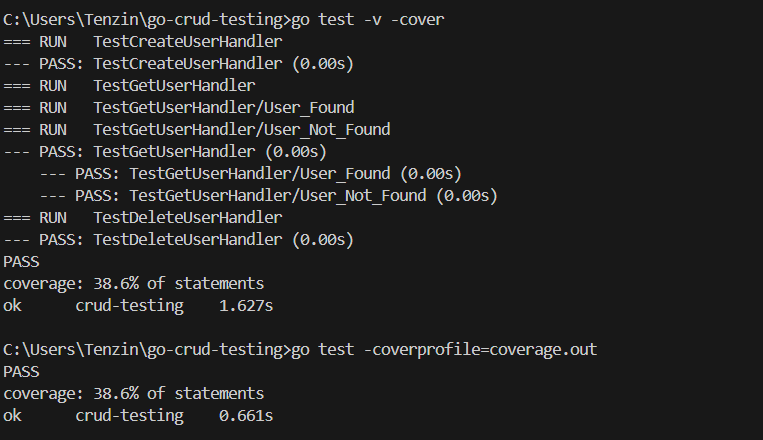
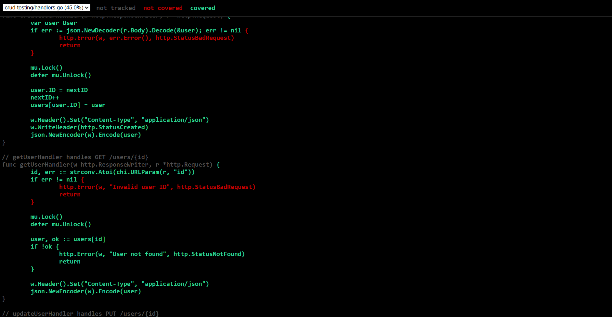

### Go CRUD Testing Project
A practical implementation of unit testing and code coverage for a Go HTTP server with CRUD operations.

#### Project Overview
This project demonstrates professional unit testing practices for a REST API built in Go. It includes a simple in-memory Users API with comprehensive test coverage and visual coverage reporting.

#### What's Implemented 
- Complete CRUD API: Create, Read, Update, Delete operations for user management
- Full Test Suite: Unit tests covering all endpoints and error scenarios
- Coverage Analysis: Visual HTML reports showing line-by-line test coverage
- HTTP Testing: Proper testing of HTTP handlers using net/http/httptest

#### Running Tests

```
# Run all tests
go test -v

# Run tests with coverage summary
go test -v -cover

# Generate detailed coverage report
go test -coverprofile=coverage.out
go tool cover -html=coverage.out
```

#### Test Coverage

The project achieves 38%+ code coverage with comprehensive testing of:

-  All CRUD operations (GET, POST, PUT, DELETE)
- Success and error scenarios
-  JSON request/response handling
- HTTP status codes validation
-  Edge cases and invalid inputs




#### Key Testing Features

- Mock HTTP Requests: Using httptest.NewRequest() for simulated requests
- Response Recording: Using httptest.NewRecorder() to capture responses
- Visual Coverage: HTML reports with color-coded coverage analysis
- Concurrent Safety: Tests verify thread-safe operations


#### Coverage Report
The HTML coverage report provides:

- Green highlighting: Code executed by tests
- Red highlighting: Untested code paths
- Line-by-line analysis: Detailed coverage breakdown
- Interactive navigation: Easy browsing of source files


