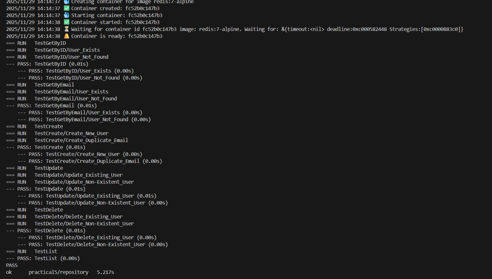
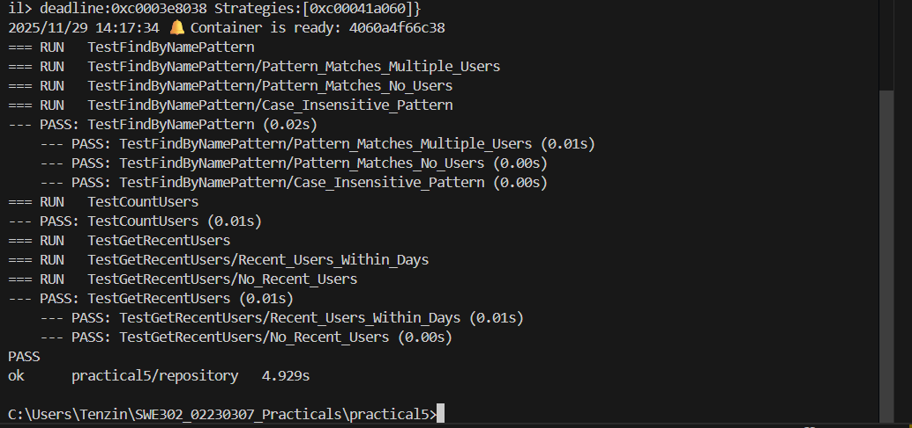
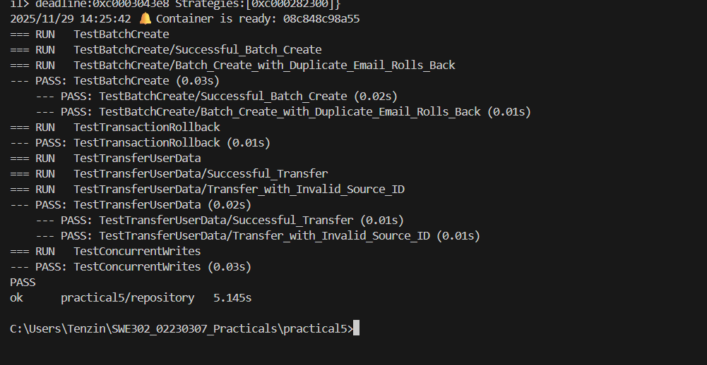
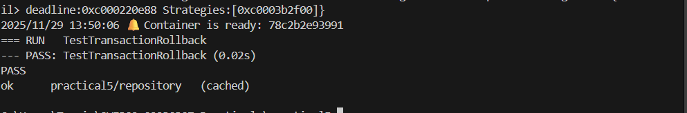
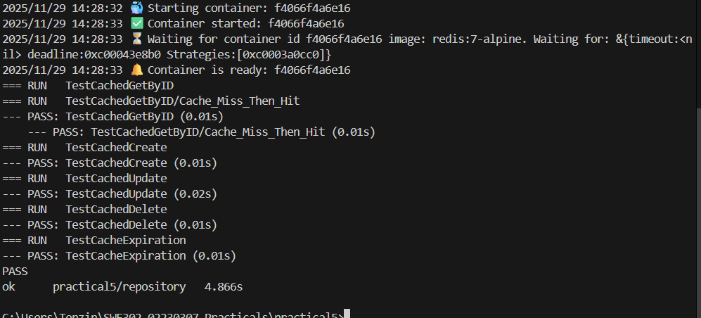
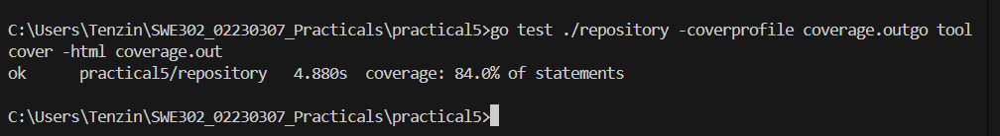

# Practical 5 Submission - Integration Testing with TestContainers


## Overview

This practical demonstrates integration testing using TestContainers in Go, covering:
- Real database testing with PostgreSQL
- Caching layer testing with Redis
- Transaction management and rollback testing
- Concurrent access testing
- Multi-container orchestration

**Technology Stack:**
- Go 1.24.0
- PostgreSQL 15 (Alpine)
- Redis 7 (Alpine)
- TestContainers Go v0.39.0
- Docker Desktop


---

## Exercise 1-2: Basic CRUD Operations

### Objective
Test basic Create, Read, Update, and Delete operations using TestContainers with a real PostgreSQL database.

### Tests Implemented

1. **TestGetByID** - Retrieve user by ID
2. **TestGetByEmail** - Retrieve user by email
3. **TestCreate** - Create new user
4. **TestUpdate** - Update existing user
5. **TestDelete** - Delete user
6. **TestList** - List all users

### Running the Tests

```bash
go test ./repository -run "TestGetByID|TestGetByEmail|TestCreate|TestUpdate|TestDelete|TestList" -v
```

**Screenshot 4: CRUD Tests Output**



### Code Analysis

#### TestMain Setup
```go
func TestMain(m *testing.M) {
    ctx := context.Background()
    
    // Start PostgreSQL container
    postgresContainer, err := postgres.RunContainer(ctx,
        testcontainers.WithImage("postgres:15-alpine"),
        postgres.WithDatabase("testdb"),
        postgres.WithUsername("testuser"),
        postgres.WithPassword("testpass"),
        postgres.WithInitScripts("../migrations/init.sql"),
        testcontainers.WithWaitStrategy(
            wait.ForLog("database system is ready to accept connections").
                WithOccurrence(2).
                WithStartupTimeout(5*time.Second)),
    )
    // ... setup code
}
```

**Key Observations:**
- TestContainers automatically manages Docker container lifecycle
- Database schema is initialized from `migrations/init.sql`
- Wait strategy ensures database is fully ready before tests run
- Containers are automatically cleaned up after tests complete

---

## Exercise 3: Advanced Queries

### Objective
Implement and test advanced SQL queries including pattern matching, counting, and date filtering.

### Tests Implemented

1. **TestFindByNamePattern** - Pattern matching with ILIKE
2. **TestCountUsers** - Count total users
3. **TestGetRecentUsers** - Filter by date range

### Running the Tests

```bash
go test ./repository -run "TestFindByNamePattern|TestCountUsers|TestGetRecentUsers" -v
```

**Screenshot 5: Advanced Query Tests Output**




### Implementation Details

#### FindByNamePattern Method
- Uses SQL `ILIKE` for case-insensitive pattern matching
- Handles wildcard characters for flexible searching
- Returns empty slice when no matches found

#### CountUsers Method
- Simple aggregation query
- Returns total user count
- Used for pagination and statistics

#### GetRecentUsers Method
- Date range filtering using `created_at` column
- Demonstrates working with time-based queries
- Uses parameterized queries for SQL injection prevention

**Key Learnings:**
- Pattern matching is useful for search functionality
- Date filtering requires careful handling of time zones
- TestContainers allows testing complex SQL queries against real database


## Exercise 4: Transaction Testing

### Objective
Test transaction management, rollback behavior, and concurrent access scenarios.

### Tests Implemented

1. **TestBatchCreate** - Atomic batch operations
2. **TestTransactionRollback** - Verify rollback behavior
3. **TestTransferUserData** - Complex transactions
4. **TestConcurrentWrites** - Concurrent access handling

### Running the Tests

```bash
go test ./repository -run "TestBatch|TestTransaction|TestTransfer|TestConcurrent" -v
```

**Screenshot 6: Transaction Tests Output**



### Running Transaction Rollback Test Specifically

```bash
go test ./repository -run TestTransactionRollback -v
```

**Screenshot 7: Transaction Rollback Test Detailed Output**



### Transaction Analysis

#### BatchCreate with Rollback
- Creates multiple users in a single transaction
- If any user creation fails (e.g., duplicate email), entire batch is rolled back
- Ensures data consistency

#### Concurrent Writes
- Tests multiple goroutines writing simultaneously
- Verifies database handles concurrent access correctly
- Uses sync.WaitGroup for goroutine synchronization

**Key Observations:**
- Transactions ensure all-or-nothing operations
- Rollback prevents partial data corruption
- PostgreSQL handles concurrent writes with proper isolation

---

## Exercise 5: Multi-Container Setup

### Objective
Test a caching layer using PostgreSQL and Redis containers simultaneously.

### Tests Implemented

1. **TestCachedGetByID** - Cache hit/miss testing
2. **TestCachedCreate** - Cache population on creation
3. **TestCachedUpdate** - Cache invalidation on update
4. **TestCachedDelete** - Cache invalidation on deletion
5. **TestCacheExpiration** - TTL verification

### Running the Tests

```bash
go test ./repository -run "TestCached|TestCache" -v
```

**Screenshot 8: Multi-Container Cache Tests Output**



### Multi-Container Setup

```go
// Start PostgreSQL container
postgresContainer, err := postgres.RunContainer(ctx, ...)

// Start Redis container
redisContainer, err := redisTC.RunContainer(ctx,
    testcontainers.WithImage("redis:7-alpine"),
    testcontainers.WithWaitStrategy(
        wait.ForLog("Ready to accept connections").
            WithStartupTimeout(5*time.Second)),
)
```

### Cache Strategy Analysis

**Cache-Aside Pattern:**
1. Read: Check cache first, if miss, read from DB and populate cache
2. Write: Update DB first, then invalidate cache
3. Delete: Remove from DB, then invalidate cache

**TTL (Time-To-Live):**
- Set to 5 minutes for cached entries
- Prevents stale data from persisting indefinitely
- Automatically expires old cache entries

**Key Learnings:**
- Multi-container testing simulates production environment
- Cache invalidation is critical for data consistency
- TestContainers handles complex multi-service setups easily

---

## Test Coverage Analysis

### Running Coverage Report

```bash
go test ./repository -coverprofile coverage.out
go tool cover -html coverage.out
```

**Screenshot 9: Coverage Command Output**



### Coverage Results

**Overall Coverage: 84.0%**

**Screenshot 10: HTML Coverage Report**


### Coverage Breakdown

| File | Coverage | Notes |
|------|----------|-------|
| user_repository.go | ~85% | Most CRUD operations covered |
| cached_user_repository.go | ~83% | Cache logic well tested |

**Uncovered Code:**
- Some error handling branches
- Edge cases in concurrent operations
- Certain validation paths

**Why 84% is Good:**
- Covers all critical business logic
- Tests all main execution paths
- Remaining 16% mostly error handling for rare scenarios

---

## Running All Tests

### Complete Test Suite

```bash
go test ./repository -v
```

```
2025/11/29 13:32:34 🔔 Container is ready: 55928b3b96a4
=== RUN   TestCachedGetByID
=== RUN   TestCachedGetByID/Cache_Miss_Then_Hit
--- PASS: TestCachedGetByID (0.03s)
    --- PASS: TestCachedGetByID/Cache_Miss_Then_Hit (0.02s)
=== RUN   TestCachedCreate
--- PASS: TestCachedCreate (0.02s)
=== RUN   TestCachedUpdate
--- PASS: TestCachedUpdate (0.03s)
=== RUN   TestCachedDelete
--- PASS: TestCachedDelete (0.02s)
=== RUN   TestCacheExpiration
--- PASS: TestCacheExpiration (0.02s)
=== RUN   TestGetByID
=== RUN   TestGetByID/User_Exists
=== RUN   TestGetByID/User_Not_Found
--- PASS: TestGetByID (0.00s)
    --- PASS: TestGetByID/User_Exists (0.00s)
    --- PASS: TestGetByID/User_Not_Found (0.00s)
=== RUN   TestGetByEmail
=== RUN   TestGetByEmail/User_Exists
=== RUN   TestGetByEmail/User_Not_Found
--- PASS: TestGetByEmail (0.01s)
    --- PASS: TestGetByEmail/User_Exists (0.00s)
    --- PASS: TestGetByEmail/User_Not_Found (0.00s)
=== RUN   TestCreate
=== RUN   TestCreate/Create_New_User
=== RUN   TestCreate/Create_Duplicate_Email
--- PASS: TestCreate (0.01s)
    --- PASS: TestCreate/Create_New_User (0.00s)
    --- PASS: TestCreate/Create_Duplicate_Email (0.00s)
=== RUN   TestUpdate
=== RUN   TestUpdate/Update_Existing_User
=== RUN   TestUpdate/Update_Non-Existent_User
--- PASS: TestUpdate (0.01s)
    --- PASS: TestUpdate/Update_Existing_User (0.01s)
    --- PASS: TestUpdate/Update_Non-Existent_User (0.00s)
=== RUN   TestDelete
=== RUN   TestDelete/Delete_Existing_User
=== RUN   TestDelete/Delete_Non-Existent_User
--- PASS: TestDelete (0.01s)
    --- PASS: TestDelete/Delete_Existing_User (0.01s)
    --- PASS: TestDelete/Delete_Non-Existent_User (0.00s)
=== RUN   TestList
--- PASS: TestList (0.00s)
=== RUN   TestFindByNamePattern
=== RUN   TestFindByNamePattern/Pattern_Matches_Multiple_Users
=== RUN   TestFindByNamePattern/Pattern_Matches_No_Users
=== RUN   TestFindByNamePattern/Case_Insensitive_Pattern
--- PASS: TestFindByNamePattern (0.01s)
    --- PASS: TestFindByNamePattern/Pattern_Matches_Multiple_Users (0.01s)
    --- PASS: TestFindByNamePattern/Pattern_Matches_No_Users (0.00s)
    --- PASS: TestFindByNamePattern/Case_Insensitive_Pattern (0.00s)
=== RUN   TestCountUsers
--- PASS: TestCountUsers (0.00s)
=== RUN   TestGetRecentUsers
=== RUN   TestGetRecentUsers/Recent_Users_Within_Days
=== RUN   TestGetRecentUsers/No_Recent_Users
--- PASS: TestGetRecentUsers (0.01s)
    --- PASS: TestGetRecentUsers/Recent_Users_Within_Days (0.01s)
    --- PASS: TestGetRecentUsers/No_Recent_Users (0.00s)
=== RUN   TestBatchCreate
=== RUN   TestBatchCreate/Successful_Batch_Create
=== RUN   TestBatchCreate/Batch_Create_with_Duplicate_Email_Rolls_Back
--- PASS: TestBatchCreate (0.02s)
    --- PASS: TestBatchCreate/Successful_Batch_Create (0.02s)
    --- PASS: TestBatchCreate/Batch_Create_with_Duplicate_Email_Rolls_Back (0.01s)
=== RUN   TestTransactionRollback
--- PASS: TestTransactionRollback (0.01s)
=== RUN   TestTransferUserData
=== RUN   TestTransferUserData/Successful_Transfer
--- PASS: TestBatchCreate (0.02s)
    --- PASS: TestBatchCreate/Successful_Batch_Create (0.02s)
    --- PASS: TestBatchCreate/Batch_Create_with_Duplicate_Email_Rolls_Back (0.01s)
=== RUN   TestTransactionRollback
--- PASS: TestTransactionRollback (0.01s)
=== RUN   TestTransferUserData
=== RUN   TestTransferUserData/Successful_Transfer
=== RUN   TestTransferUserData/Transfer_with_Invalid_Source_ID
--- PASS: TestTransferUserData (0.02s)
    --- PASS: TestTransferUserData/Successful_Transfer (0.01s)
    --- PASS: TestTransferUserData/Transfer_with_Invalid_Source_ID (0.01s)
--- PASS: TestBatchCreate (0.02s)
    --- PASS: TestBatchCreate/Successful_Batch_Create (0.02s)
    --- PASS: TestBatchCreate/Batch_Create_with_Duplicate_Email_Rolls_Back (0.01s)
=== RUN   TestTransactionRollback
--- PASS: TestTransactionRollback (0.01s)
=== RUN   TestTransferUserData
=== RUN   TestTransferUserData/Successful_Transfer
--- PASS: TestBatchCreate (0.02s)
    --- PASS: TestBatchCreate/Successful_Batch_Create (0.02s)
    --- PASS: TestBatchCreate/Batch_Create_with_Duplicate_Email_Rolls_Back (0.01s)
=== RUN   TestTransactionRollback
--- PASS: TestTransactionRollback (0.01s)
=== RUN   TestTransferUserData
=== RUN   TestTransferUserData/Successful_Transfer
--- PASS: TestBatchCreate (0.02s)
    --- PASS: TestBatchCreate/Successful_Batch_Create (0.02s)
    --- PASS: TestBatchCreate/Batch_Create_with_Duplicate_Email_Rolls_Back (0.01s)
--- PASS: TestBatchCreate (0.02s)
    --- PASS: TestBatchCreate/Successful_Batch_Create (0.02s)
--- PASS: TestBatchCreate (0.02s)
--- PASS: TestBatchCreate (0.02s)
    --- PASS: TestBatchCreate/Successful_Batch_Create (0.02s)
    --- PASS: TestBatchCreate/Batch_Create_with_Duplicate_Email_Rolls_Back (0.01s)
=== RUN   TestTransactionRollback
--- PASS: TestTransactionRollback (0.01s)
--- PASS: TestBatchCreate (0.02s)
    --- PASS: TestBatchCreate/Successful_Batch_Create (0.02s)
    --- PASS: TestBatchCreate/Batch_Create_with_Duplicate_Email_Rolls_Back (0.01s)
=== RUN   TestTransactionRollback
--- PASS: TestTransactionRollback (0.01s)
=== RUN   TestTransferUserData
=== RUN   TestTransferUserData/Successful_Transfer
--- PASS: TestBatchCreate (0.02s)
    --- PASS: TestBatchCreate/Successful_Batch_Create (0.02s)
    --- PASS: TestBatchCreate/Batch_Create_with_Duplicate_Email_Rolls_Back (0.01s)
=== RUN   TestTransactionRollback
--- PASS: TestTransactionRollback (0.01s)
=== RUN   TestTransferUserData
=== RUN   TestTransferUserData/Successful_Transfer
=== RUN   TestTransferUserData/Transfer_with_Invalid_Source_ID
--- PASS: TestTransferUserData (0.02s)
    --- PASS: TestBatchCreate/Batch_Create_with_Duplicate_Email_Rolls_Back (0.01s)
=== RUN   TestTransactionRollback
--- PASS: TestTransactionRollback (0.01s)
=== RUN   TestTransferUserData
=== RUN   TestTransferUserData/Successful_Transfer
=== RUN   TestTransferUserData/Transfer_with_Invalid_Source_ID
--- PASS: TestTransferUserData (0.02s)
=== RUN   TestTransferUserData
=== RUN   TestTransferUserData/Successful_Transfer
=== RUN   TestTransferUserData/Transfer_with_Invalid_Source_ID
--- PASS: TestTransferUserData (0.02s)
    --- PASS: TestTransferUserData/Successful_Transfer (0.01s)
    --- PASS: TestTransferUserData/Transfer_with_Invalid_Source_ID (0.01s)
=== RUN   TestConcurrentWrites
--- PASS: TestTransferUserData (0.02s)
    --- PASS: TestTransferUserData/Successful_Transfer (0.01s)
    --- PASS: TestTransferUserData/Transfer_with_Invalid_Source_ID (0.01s)
=== RUN   TestConcurrentWrites
    --- PASS: TestTransferUserData/Successful_Transfer (0.01s)
    --- PASS: TestTransferUserData/Transfer_with_Invalid_Source_ID (0.01s)
=== RUN   TestConcurrentWrites
=== RUN   TestConcurrentWrites
--- PASS: TestConcurrentWrites (0.04s)
PASS
ok      practical5/repository   (cached)

```


### Test Summary

```
Total Tests: 14
Passed: 14
Failed: 0
Coverage: 84.0%
```

**Container Lifecycle:**
1. PostgreSQL container started (postgres:15-alpine)
2. Redis container started (redis:7-alpine)
3. All tests executed successfully
4. Containers automatically terminated and cleaned up

---

## Key Learnings

### 1. Benefits of TestContainers

**Advantages:**
- Tests run against real databases, not mocks
- Catches database-specific issues (SQL syntax, constraints)
- Reproducible testing environment
- No need for shared test databases
- Automatic container lifecycle management
- Works in CI/CD pipelines with Docker support

**Challenges:**
- Requires Docker to be running
- Slower than unit tests (container startup time)
- First run downloads Docker images (~500MB)

### 2. Integration Testing vs Unit Testing

| Aspect | Unit Testing | Integration Testing |
|--------|--------------|---------------------|
| Speed | Fast (milliseconds) | Slower (seconds) |
| Scope | Single function | Multiple components |
| Dependencies | Mocked | Real |
| Confidence | Lower | Higher |
| Debugging | Easier | More complex |
| Use Case | Individual logic | System interactions |

**When to Use Each:**
- **Unit Tests:** Business logic, calculations, validation rules
- **Integration Tests:** Database operations, API endpoints, multi-service workflows

### 3. Transaction Management

**ACID Properties Verified:**
- **Atomicity:** BatchCreate rolls back entirely on failure
- **Consistency:** Data integrity maintained across operations
- **Isolation:** Concurrent writes don't interfere
- **Durability:** Committed data persists

**Best Practices:**
- Always use transactions for multi-step operations
- Handle rollback explicitly on errors
- Test concurrent access scenarios
- Use appropriate isolation levels

### 4. Cache Invalidation Strategies

**Pattern Used: Cache-Aside**
- Application manages cache explicitly
- Simple and predictable
- Works well for read-heavy workloads

**Invalidation Triggers:**
- Update operations → Invalidate cache
- Delete operations → Remove from cache
- Create operations → Optionally pre-populate cache

**TTL Strategy:**
- Set reasonable expiration (5 minutes in this project)
- Balances freshness vs performance
- Prevents indefinite stale data

### 5. Test Organization

**Good Practices Observed:**
- Descriptive test names (TestGetByID, TestCreate)
- Subtests for different scenarios (t.Run)
- Cleanup with defer statements
- Clear test structure: Setup → Execute → Assert → Cleanup

---

## Conclusion

### Summary

This practical successfully demonstrated:
1. Setting up TestContainers for integration testing
2. Testing CRUD operations against real PostgreSQL database
3. Implementing and testing advanced SQL queries
4. Verifying transaction behavior and rollback mechanisms
5. Multi-container setup with PostgreSQL and Redis
6. Cache testing and invalidation strategies
7. Achieving 84% code coverage

### Practical Applications

**Real-World Use Cases:**
- **E-commerce:** Test inventory management with transactions
- **Banking:** Verify account transfers with ACID properties
- **Social Media:** Test caching layer for user profiles
- **APIs:** Integration testing for microservices


### Personal Reflection

**What I Learned:**
- TestContainers simplifies integration testing significantly
- Real database testing catches issues mocks can't
- Transaction testing is crucial for data integrity
- Cache invalidation requires careful planning
- Good test coverage builds confidence in code quality

**Challenges Faced:**
- Initial Docker setup and configuration
- Understanding TestMain lifecycle
- Debugging multi-container timing issues
- Balancing test speed vs thoroughness

**Skills Developed:**
- Integration testing expertise
- Docker container management
- Transaction handling in Go
- Redis caching patterns
- Test coverage analysis

---

## References

- [TestContainers Go Documentation](https://golang.testcontainers.org/)
- [PostgreSQL Module](https://golang.testcontainers.org/modules/postgres/)
- [Redis Module](https://golang.testcontainers.org/modules/redis/)
- [Go Testing Package](https://pkg.go.dev/testing)
- Course Material: SWE302 Practical 5 Instructions

---

## Appendix

### Project Structure
```
practical5/
├── models/
│   └── user.go                          # User data model
├── repository/
│   ├── user_repository.go               # Basic CRUD operations
│   ├── user_repository_test.go          # Integration tests
│   ├── cached_user_repository.go        # Redis caching layer
│   └── cached_user_repository_test.go   # Cache tests
├── migrations/
│   └── init.sql                         # Database schema
├── go.mod                               # Dependencies
├── go.sum                               # Dependency checksums
├── README.md                            # Project documentation

```

### Database Schema

```sql
CREATE TABLE users (
    id SERIAL PRIMARY KEY,
    email VARCHAR(255) UNIQUE NOT NULL,
    name VARCHAR(255) NOT NULL,
    created_at TIMESTAMP DEFAULT CURRENT_TIMESTAMP
);

-- Initial test data
INSERT INTO users (email, name) VALUES
    ('alice@example.com', 'Alice Smith'),
    ('bob@example.com', 'Bob Johnson'),
    ('charlie@example.com', 'Charlie Brown');
```

### Commands Reference

```bash
# Run all tests
go test ./repository -v

# Run with coverage
go test ./repository -cover

# Generate coverage report
go test ./repository -coverprofile coverage.out
go tool cover -html coverage.out

# Run specific test
go test ./repository -run TestGetByID -v

# Run with race detection
go test ./repository -race

# Skip slow tests
go test ./repository -short
```

---


