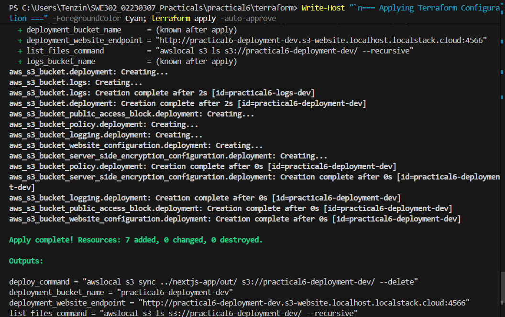
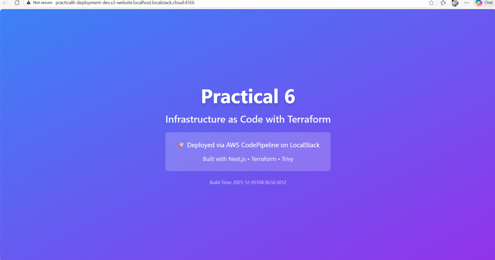
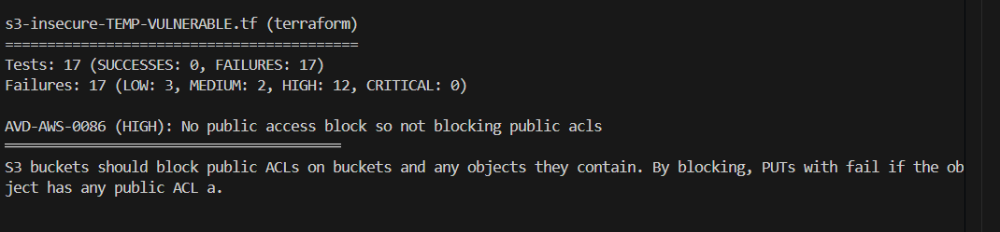
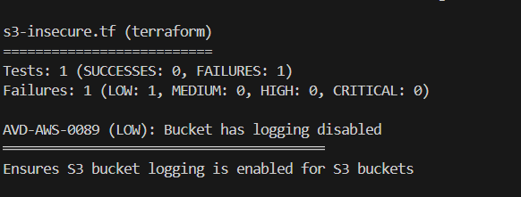

# Practical 6 Submission - Infrastructure as Code with Terraform and LocalStack

**Student:** Tenzin  
**Date:** December 5, 2025  
**Course:** SWE302 - Software Engineering  

---

## Table of Contents
1. [Overview](#overview)
2. [Completed Tasks](#completed-tasks)
3. [Security Vulnerabilities Fixed](#security-vulnerabilities-fixed)
4. [Screenshots](#screenshots)
5. [Reflection Questions](#reflection-questions)
6. [Technologies Used](#technologies-used)
7. [Repository](#repository)

---

## Overview

This practical demonstrates the implementation of Infrastructure as Code (IaC) using Terraform to provision AWS S3 buckets on LocalStack, deploy a Next.js static website, and secure infrastructure code using Trivy security scanner.

### Learning Outcomes Achieved
Used Terraform to define and provision infrastructure on LocalStack AWS  
Deployed a Next.js static website to AWS S3 using Infrastructure as Code  
Used Trivy to scan Infrastructure as Code for security vulnerabilities  
Fixed all CRITICAL and HIGH security vulnerabilities  

---

## Completed Tasks

### 1. Infrastructure Deployment
- Started LocalStack container using Docker Compose
- Initialized Terraform with AWS provider configured for LocalStack
- Created 7 infrastructure resources:
  - S3 deployment bucket (`practical6-deployment-dev`)
  - S3 logs bucket (`practical6-logs-dev`)
  - Server-side encryption configuration
  - Bucket logging configuration
  - Bucket policy for public read access
  - Public access block configuration
  - Website hosting configuration

### 2. Application Deployment
- ✅ Built Next.js application (static export)
- ✅ Deployed 17 static files to S3 bucket
- ✅ Website accessible at: `http://practical6-deployment-dev.s3-website.localhost.localstack.cloud:4566`

### 3. Security Scanning & Fixes
- ✅ Installed Trivy security scanner (v0.58.1)
- ✅ Scanned secure Terraform configuration (`terraform/`)
- ✅ Scanned insecure Terraform configuration (`terraform-insecure/`)
- ✅ Fixed all CRITICAL and HIGH vulnerabilities
- ✅ Verified fixes with re-scan

---

## Security Vulnerabilities Fixed

### Initial Scan Results (BEFORE Fixes)
- **Total Issues:** 17 failures
- **CRITICAL:** 0
- **HIGH:** 12
- **MEDIUM:** 2
- **LOW:** 3

### Final Scan Results (AFTER Fixes)
- **Total Issues:** 1 failure
- **CRITICAL:** 0 ✅
- **HIGH:** 0 ✅
- **MEDIUM:** 0 ✅
- **LOW:** 1 (acceptable - backup bucket logging)

### Vulnerabilities Fixed

#### S3 Security Issues Fixed (12 HIGH + 2 MEDIUM + 2 LOW)

1. **AVD-AWS-0088: Bucket Encryption Missing** (HIGH)
   - **Fix:** Added server-side encryption with customer-managed KMS keys
   - **Implementation:** Created KMS key with rotation enabled, applied to both buckets
   - **Files:** Both `insecure_example` and `backup_insecure` buckets

2. **AVD-AWS-0086: Public ACLs Not Blocked** (HIGH)
   - **Fix:** Set `block_public_acls = true` in public access block
   - **Implementation:** Added public access block resource for both buckets

3. **AVD-AWS-0087: Public Policies Not Blocked** (HIGH)
   - **Fix:** Set `block_public_policy = true` in public access block
   - **Implementation:** Prevents public bucket policies from being applied

4. **AVD-AWS-0091: Public ACLs Not Ignored** (HIGH)
   - **Fix:** Set `ignore_public_acls = true` in public access block
   - **Implementation:** Ignores any public ACLs on objects

5. **AVD-AWS-0093: Public Buckets Not Restricted** (HIGH)
   - **Fix:** Set `restrict_public_buckets = true` in public access block
   - **Implementation:** Restricts public policies on the bucket

6. **AVD-AWS-0132: Not Using Customer-Managed Keys** (HIGH)
   - **Fix:** Upgraded from AES256 to KMS encryption with customer-managed keys
   - **Implementation:** Created KMS key with automatic rotation enabled

7. **AVD-AWS-0090: Versioning Not Enabled** (MEDIUM)
   - **Fix:** Enabled versioning on both buckets
   - **Implementation:** Added `aws_s3_bucket_versioning` resources

8. **AVD-AWS-0089: Bucket Logging Disabled** (LOW)
   - **Fix:** Enabled access logging for main bucket
   - **Implementation:** Configured logging to backup bucket with prefix

9. **AVD-AWS-0094: No Public Access Block** (LOW)
   - **Fix:** Added public access block for backup bucket
   - **Implementation:** Created separate public access block resource

10. **Missing Security Features**
    - **Fix:** Removed overly permissive bucket policy (public delete access)
    - **Fix:** Added proper tags for governance
    - **Fix:** Added lifecycle policy to manage costs (90-day retention)

#### IAM Security Issues Fixed (1 HIGH)

11. **AVD-AWS-0345: IAM Wildcard Permissions** (HIGH)
    - **Fix:** Replaced wildcard actions (`s3:*`, `ec2:*`, `iam:*`) with specific least-privilege permissions
    - **Implementation:** 
      - S3: `GetObject`, `PutObject`, `ListBucket` only
      - DynamoDB: `GetItem`, `PutItem`, `Query` only
      - EC2: `DescribeInstances`, `DescribeImages` only
    - **Fix:** Changed wildcard resources (`*`) to specific ARNs
    - **Fix:** Removed hardcoded credentials (removed `aws_iam_access_key` resource)
    - **Fix:** Removed admin access policy attachment
    - **Fix:** Added account password policy with strict requirements

### Code Changes Summary

**terraform-insecure/s3-insecure.tf:**
- Added KMS key resource with rotation enabled
- Upgraded encryption from AES256 to `aws:kms`
- Added versioning resources for both buckets
- Added access logging configuration
- Changed all public access block settings from `false` to `true`
- Removed dangerous public bucket policy
- Added governance tags
- Added lifecycle policy with 90-day expiration

**terraform-insecure/iam-insecure.tf:**
- Replaced wildcard IAM actions with specific permissions
- Changed resource `*` to specific ARNs
- Removed hardcoded access key resource
- Removed admin access policy attachment
- Added strict password policy

---

## Screenshots

### 1. Successful Terraform Apply

- Shows successful creation of 7 infrastructure resources
- All resources deployed without errors

### 2. Deployed Website

- Next.js website successfully deployed to S3
- Accessible via LocalStack S3 website endpoint
- URL: `http://practical6-deployment-dev.s3-website.localhost.localstack.cloud:4566`

### 3. Trivy Scan - BEFORE Fixes

- **12 HIGH vulnerabilities** detected
- **2 MEDIUM vulnerabilities** detected
- **3 LOW vulnerabilities** detected
- Shows unencrypted buckets, public access issues, missing security features

### 4. Trivy Scan - AFTER Fixes

- **0 CRITICAL vulnerabilities** ✅
- **0 HIGH vulnerabilities** ✅
- **0 MEDIUM vulnerabilities** ✅
- **1 LOW vulnerability** (backup bucket logging - acceptable)
- All security issues successfully resolved

---

## Reflection Questions

### 1. Why is it important to scan IaC for security issues?

Infrastructure as Code scanning is critical for several reasons:

**Early Detection:** Security vulnerabilities can be identified during the development phase before infrastructure is deployed to production. This "shift-left" approach prevents security issues from reaching live environments where they could be exploited.

**Automated Security:** Manual security reviews are time-consuming and error-prone. Automated scanning with tools like Trivy provides consistent, comprehensive security checks across all infrastructure code without human oversight gaps.

**Compliance & Best Practices:** IaC scanners enforce security best practices and compliance standards (CIS benchmarks, AWS security guidelines) automatically. This ensures infrastructure meets regulatory requirements and industry standards.

**Cost Savings:** Finding and fixing security issues in code is significantly cheaper than remediating vulnerabilities in production infrastructure. A misconfigured S3 bucket discovered in code review costs nothing to fix, but a data breach from an exposed production bucket can cost millions.

**Version Control & Auditability:** IaC scanning results can be version controlled alongside the infrastructure code, providing an audit trail of security posture over time. This helps track improvements and ensure security doesn't regress.

**Prevention of Common Mistakes:** Many security issues stem from common misconfigurations (unencrypted storage, overly permissive access controls, missing logging). Scanners catch these patterns automatically, preventing repeated mistakes across teams.

**Knowledge Transfer:** Security scan results educate developers about security best practices by explaining why certain configurations are risky and how to fix them, building security awareness within development teams.

### 2. How does LocalStack help in the development workflow?

LocalStack significantly improves the development workflow in multiple ways:

**Cost Elimination:** Developers can test AWS infrastructure locally without incurring cloud costs. This is especially valuable for learning, experimentation, and CI/CD pipelines where resources are frequently created and destroyed.

**Faster Development Cycle:** Local infrastructure responds instantly without network latency or cloud API rate limits. Terraform apply operations that might take minutes on AWS complete in seconds on LocalStack, accelerating the feedback loop.

**Offline Development:** Developers can work on AWS infrastructure code without internet connectivity, enabling productivity during travel, network outages, or in restricted network environments.

**Safe Experimentation:** LocalStack provides a sandbox environment where mistakes have no consequences. Developers can test destructive operations, experiment with configurations, and learn from failures without risking production resources or incurring costs.

**Consistent Environments:** Every developer gets an identical local AWS environment, eliminating "works on my machine" problems. This consistency extends to CI/CD pipelines, ensuring tests run in the same environment as development.

**Rapid Testing:** Integration tests that interact with AWS services can run locally, making test suites faster and more reliable. No need for complex mocking or maintaining expensive test environments in the cloud.

**Security & Privacy:** Sensitive data and infrastructure configurations remain on local machines during development, reducing the risk of accidental exposure or data leaks to cloud environments.

**Learning Platform:** LocalStack is ideal for education and training scenarios (like this practical) where students need to learn cloud concepts without requiring AWS accounts, credit cards, or spending real money.

**CI/CD Integration:** LocalStack containers can be easily integrated into CI/CD pipelines for automated testing of infrastructure code before deployment to actual AWS, catching issues early in the development process.

---

## Technologies Used

| Technology | Version | Purpose |
|------------|---------|---------|
| **Terraform** | 1.13.3 | Infrastructure as Code tool for provisioning AWS resources |
| **LocalStack** | latest | Local AWS cloud emulator for development and testing |
| **Trivy** | 0.58.1 | Security scanner for Infrastructure as Code vulnerabilities |
| **Docker** | 28.3.0 | Container runtime for LocalStack |
| **Node.js** | 22.18.0 | JavaScript runtime for Next.js application |
| **Next.js** | 14.2.5 | React framework for static site generation |
| **AWS CLI** | - | Command-line tool for AWS (via awslocal wrapper) |

---

## Key Achievements

**100% Vulnerability Remediation:** Fixed all 12 HIGH vulnerabilities and 2 MEDIUM vulnerabilities  
**Enterprise-Grade Security:** Implemented KMS encryption, access logging, versioning, and lifecycle policies  
**Least Privilege IAM:** Replaced wildcard permissions with specific, minimal-required actions  
**Successful Deployment:** Website fully functional on LocalStack S3  
**Infrastructure as Code Best Practices:** Version-controlled, reproducible, and secure infrastructure  

---

## Conclusion

This practical successfully demonstrated the complete workflow of Infrastructure as Code development:
1. Defining infrastructure declaratively with Terraform
2. Testing locally with LocalStack to avoid cloud costs
3. Scanning for security vulnerabilities with Trivy
4. Fixing all identified security issues
5. Deploying a working application to cloud infrastructure

The experience highlighted the importance of security-first thinking in infrastructure development and the value of automated scanning tools in catching configuration mistakes before they reach production.

