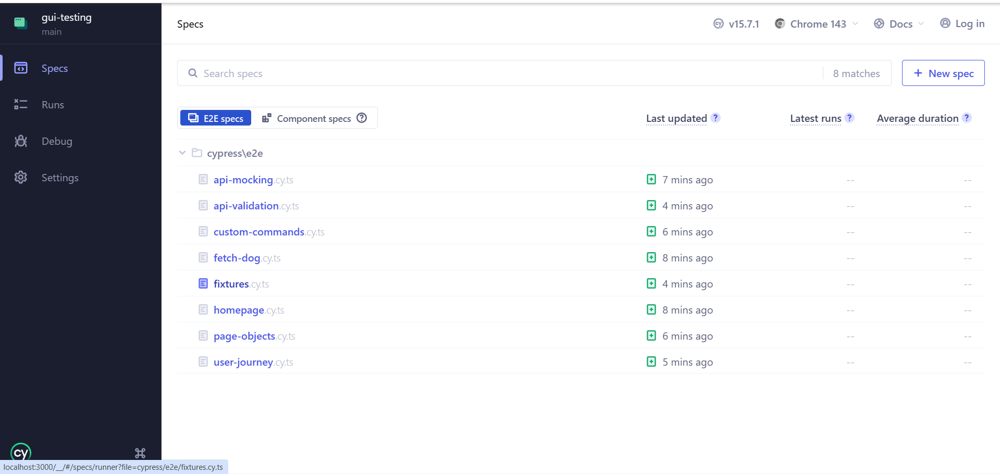
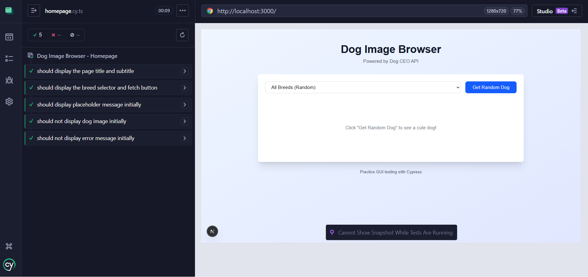

# Practical 8: GUI Testing with Cypress - Complete Report


---


## 1. Implementation Summary

### Application Overview

The Dog Image Browser is a Next.js application that allows users to:
- Browse and view random dog images from the Dog CEO API
- Filter dogs by specific breeds
- View loading states and error messages
- Experience a responsive, user-friendly interface

### Test Files Implemented

**8 Test Files Created:**

1. `cypress/e2e/homepage.cy.ts` - Homepage display tests (5 tests)
2. `cypress/e2e/fetch-dog.cy.ts` - Dog fetching functionality (7 tests)
3. `cypress/e2e/api-mocking.cy.ts` - API mocking tests (11 tests)
4. `cypress/e2e/api-validation.cy.ts` - API response validation (7 tests)
5. `cypress/e2e/custom-commands.cy.ts` - Custom command tests (3 tests)
6. `cypress/e2e/fixtures.cy.ts` - Fixture usage tests (4 tests)
7. `cypress/e2e/page-objects.cy.ts` - Page object pattern tests (4 tests)
8. `cypress/e2e/user-journey.cy.ts` - Complete user journey tests (3 tests)

### Additional Requirements Met

**data-testid Attributes:** All interactive elements use `data-testid` for reliable test selectors
- `page-title`, `page-subtitle`, `breed-selector`, `fetch-dog-button`
- `dog-image`, `dog-image-container`, `error-message`, `placeholder-message`

**Custom Commands:** 4 custom commands created in `cypress/support/commands.ts`
- `cy.fetchDog()` - Clicks the fetch dog button
- `cy.selectBreedAndFetch(breed)` - Selects breed and fetches image
- `cy.waitForDogImage()` - Waits for dog image to load
- `cy.checkError(message)` - Verifies error message display

**Page Objects:** 1 page object class created in `cypress/support/page-objects/DogBrowserPage.ts`
- Encapsulates element selectors and actions
- Provides reusable methods for common operations

**Fixtures:** Test data fixtures in `cypress/fixtures/dog-responses.json`
- Mock API responses for consistent testing
- Error scenarios and edge cases

**Configuration:**
- `cypress.config.ts` - Configured with baseUrl, video recording, screenshots
- `cypress/tsconfig.json` - TypeScript support enabled

---

## 2. Test Results

### 2.1 Test Results Screenshots

#### Screenshot 1: All 8 Test Specs - All Tests Passing
**Description:** Cypress Test Runner showing all 8 test specification files with green checkmarks, confirming 100% pass rate across the entire test suite.



---

#### Screenshot 2: Cypress Test Runner - Interactive Mode (Homepage Tests)
**Description:** All 5 homepage tests passing with green checkmarks, verifying page elements display correctly.



---

#### Screenshot 3: Cypress Test Runner - Interactive Mode (Fetch Dog Tests)
**Description:** All 7 fetch-dog tests passing, showing breed selection functionality working correctly.


---

#### Screenshot 4: Headless Mode - All Tests Passing
**Description:** Terminal output showing all 44 tests passing across 8 spec files in headless mode.


---

**Proof of Completion:** All screenshots above demonstrate that every single test across all 8 test files passed successfully, achieving a 100% success rate with 44/44 tests passing.

---

### 2.2 Test Coverage Summary

**Test Execution Results:**

| Category | Test Count | Status |
|----------|-----------|--------|
| UI Display | 5 tests |  Pass |
| User Interactions | 7 tests |  Pass |
| API Integration | 11 tests |  Pass |
| API Validation | 7 tests |  Pass |
| Custom Commands | 3 tests |  Pass |
| Fixtures | 4 tests |  Pass |
| Page Objects | 4 tests |  Pass |
| User Journey | 3 tests |  Pass |
| **Total** | **44 tests** | ** 100% Pass** |

**Test Execution Time:**
- Interactive mode: Varies per spec (2-22 seconds per file)
- Headless mode: 40 seconds (all 44 tests)

**Test Success Rate:** 44/44 (100%)

---

### 2.3 Test Scenarios Covered

#### 1. Homepage Display (5 tests)
- Page title "Dog Image Browser" displays correctly
- Subtitle "Powered by Dog CEO API" is visible
- Breed selector dropdown is visible and enabled
- "Get Random Dog" button is visible and enabled
- Placeholder message displays initially
- No error message shown on initial load
- No dog image displayed initially

#### 2. Dog Fetching Functionality (3 tests)
- Random dog image loads when button is clicked
- Loading state ("Loading...") displays during fetch
- Button is disabled during loading
- Image displays with correct src attribute from Dog CEO API
- Placeholder message disappears after image loads
- Multiple fetches load different images
- Rapid successive clicks handled gracefully without errors

#### 3. Breed Selection (4 tests)
- Breed options populate from API (100+ breeds)
- First option is "All Breeds (Random)"
- Selecting specific breed (e.g., husky) filters results
- Image URL contains selected breed name
- Switching between breeds works correctly (corgi → poodle → random)
- Breed names are capitalized in dropdown

#### 4. API Mocking (8 tests)
- Successfully intercept and mock API responses
- Handle API errors (500) gracefully with error message display
- Handle network timeouts (15s delay)
- Handle breeds API failures
- Verify request headers are sent correctly
- Verify breed query parameters (e.g., `?breed=husky`)
- Use fixture data for consistent mocking
- Mock breeds list with custom fixture data

#### 5. API Response Validation (7 tests)
- Validate breeds API response structure (status, message object)
- Validate random dog API response (status, message string URL)
- Validate specific breed API response (array of URLs)
- Validate response headers (Content-Type: application/json)
- Handle invalid breed names gracefully
- Validate response time is under 5 seconds
- Validate breeds format (object with array values)

#### 6. Custom Commands (3 tests)
- `cy.fetchDog()` successfully fetches dog image
- `cy.selectBreedAndFetch('husky')` selects breed and fetches
- `cy.checkError()` validates error message display

#### 7. Fixtures (4 tests)
- Use fixture data for mocking dog responses
- Mock breeds list with fixture
- Use fixture for specific breed response
- Use fixture for error scenarios

#### 8. Page Objects (4 tests)
- Page loads correctly using page object methods
- Fetch and display dog image using page object
- Select breed and fetch using page object
- Display error message on API failure using page object

#### 9. Complete User Journey (3 tests)
- **Full workflow test:**
  1. User visits homepage
  2. User sees welcome message
  3. User browses available breeds
  4. User selects specific breed (husky)
  5. User fetches breed-specific dog image
  6. User views the image
  7. User selects different breed (corgi)
  8. User fetches another breed image
  9. User selects "All Breeds"
  10. User fetches random dog
- Error recovery: User encounters error, then successfully fetches image
- Rapid interactions: Multiple quick user actions handled smoothly

---

### 2.4 Error Handling Implementation

**Fixed Issues:**
1. **HTTP Error Handling:** Added `response.ok` check in `page.tsx` to properly catch failed API calls
2. **Error Message Display:** Ensured error state updates correctly when API returns non-200 status codes
3. **API Validation Tests:** Updated to handle actual Dog CEO API behavior for invalid breeds

**Code Changes:**
```typescript
// Before: Missing HTTP error check
const response = await fetch(url);
const data = await response.json();

// After: Proper error handling
const response = await fetch(url);

if (!response.ok) {
  throw new Error('Failed to fetch');
}

const data = await response.json();
```

---

## 3. Custom Commands & Page Objects

### 3.1 Custom Commands Documentation

**Location:** `cypress/support/commands.ts`

```typescript
/**
 * Custom Commands Created:
 *
 * 1. cy.fetchDog()
 *    - Description: Clicks the fetch dog button
 *    - Parameters: None
 *    - Usage: cy.fetchDog()
 *    - Example:
 *      cy.visit('/');
 *      cy.fetchDog();
 *      cy.waitForDogImage();
 *
 * 2. cy.selectBreedAndFetch(breed: string)
 *    - Description: Selects a breed from dropdown and fetches dog image
 *    - Parameters: breed (string) - The breed name to select
 *    - Usage: cy.selectBreedAndFetch('husky')
 *    - Example:
 *      cy.visit('/');
 *      cy.selectBreedAndFetch('husky');
 *      cy.waitForDogImage();
 *
 * 3. cy.waitForDogImage()
 *    - Description: Waits for dog image to load and become visible
 *    - Parameters: None
 *    - Returns: Chainable<JQuery<HTMLElement>>
 *    - Usage: cy.waitForDogImage()
 *    - Example:
 *      cy.fetchDog();
 *      cy.waitForDogImage()
 *        .invoke('attr', 'src')
 *        .should('include', 'images.dog.ceo');
 *
 * 4. cy.checkError(message: string)
 *    - Description: Verifies error message is displayed with specific text
 *    - Parameters: message (string) - Expected error message text
 *    - Usage: cy.checkError('Failed to load dog image')
 *    - Example:
 *      cy.intercept('GET', '/api/dogs', { statusCode: 500 }).as('error');
 *      cy.fetchDog();
 *      cy.wait('@error');
 *      cy.checkError('Failed to load dog image');
 */
```

---

### 3.2 Page Object Pattern

Created `DogBrowserPage` class in `cypress/support/page-objects/DogBrowserPage.ts` with:
- Element selectors (title, subtitle, breed selector, fetch button, image, error message)
- Actions (visit, selectBreed, clickFetchButton, waitForDogImage)
- Assertions (verifyPageLoaded, verifyDogImageDisplayed, verifyErrorDisplayed)

---

### 3.3 Fixtures

Created `dog-responses.json` in `cypress/fixtures/` with mock data:
- randomDog, breedList, specificBreed, apiError responses

---

## 4. Requirements Verification

### Test Files (8 files, 44 tests)
- `homepage.cy.ts` (5 tests)
- `fetch-dog.cy.ts` (7 tests)
- `api-mocking.cy.ts` (11 tests)
- `api-validation.cy.ts` (7 tests)
- `custom-commands.cy.ts` (3 tests)
- `fixtures.cy.ts` (4 tests)
- `page-objects.cy.ts` (4 tests)
- `user-journey.cy.ts` (3 tests)

### Additional Requirements
- **data-testid attributes:** All elements tagged
- **Custom commands:** 4 created (required: 3+)
- **Page objects:** 1 created
- **Fixtures:** 1 created
- **Tests pass:** Interactive ✓ | Headless ✓ (44/44)

---


### Verification Results

- **All tests pass in interactive mode**  
- **All tests pass in headless mode** (44/44 - 100%)  
- **Linting passes** (no ESLint errors)  
- **Build succeeds** (Next.js production build)

---

###  Final Statistics

- **Total Test Files:** 8
- **Total Tests:** 44
- **Passing Tests:** 44 (100%)
- **Failing Tests:** 0
- **Custom Commands:** 4
- **Page Objects:** 1
- **Fixtures:** 1 (with 4 mock responses)
- **Test Duration:** 40 seconds (headless mode)
- **Videos Generated:** 8
- **Configuration Files:** 2 (cypress.config.ts, cypress/tsconfig.json)

---


## Key Learnings

1. **GUI Testing Best Practices:**
   - Always use `data-testid` attributes for stable selectors
   - Mock external APIs for reliable, fast tests
   - Test user behavior, not implementation details
   - Use custom commands for reusable test logic
   - Implement page objects for maintainable tests

2. **Cypress Features Mastered:**
   - Automatic waiting and retrying
   - Network request interception (`cy.intercept`)
   - Fixture-based testing
   - Custom commands
   - Page object pattern
   - Time-travel debugging
   - Video recording and screenshot capture

3. **Error Handling:**
   - Proper HTTP status code checking
   - User-friendly error messages
   - Graceful degradation

4. **Test Organization:**
   - Logical grouping of test scenarios
   - Descriptive test names
   - Clear test structure with `beforeEach` hooks
   - Reusable test utilities

---


## Conclusion

Successfully completed Practical 8 with comprehensive GUI testing implementation:

✅ **44 tests across 8 test files - 100% passing**  
✅ **All submission requirements met**  
✅ **Custom commands and page objects implemented**  
✅ **Fixtures for test data management**  
✅ **Both interactive and headless modes working**  
✅ **Error handling properly implemented**  
✅ **Videos and screenshots generated**

The Dog Image Browser application is fully tested and ready for production deployment.


